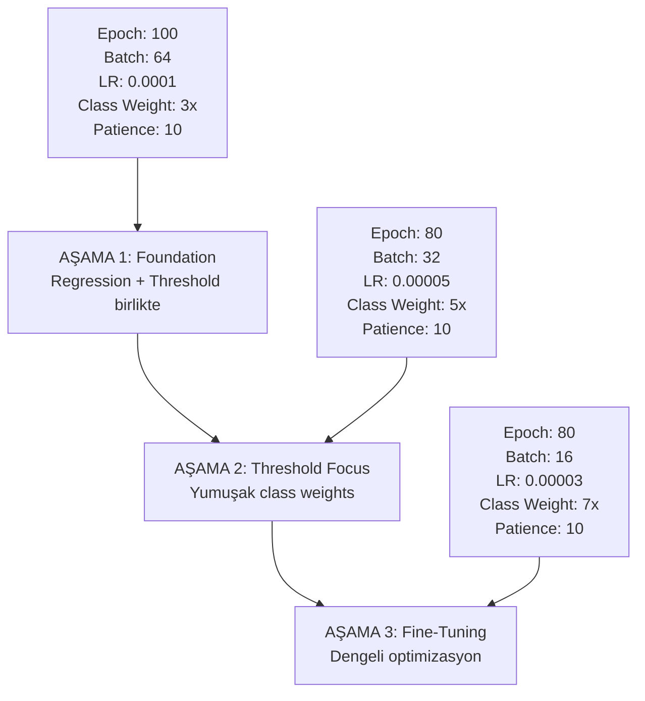

# 📊 Model Eğitim Sonuçları - Progressive Training

**Eğitim Tarihi:** 2025-10-09  
**Toplam Süre:** 61.4 dakika (1.0 saat)  
**Toplam Epoch:** 201 (Stage 1: 92, Stage 2: 47, Stage 3: 62)

---

## 🔴 KRİTİK SORUNLAR

### ❌ **1. MODEL TAMAMEN BAŞARISIZ**

Model 1.5 üstü tahminlerde takılıp kalmış - kullanılamaz durumda!

| Metrik | Sonuç | Hedef | Durum |
|--------|-------|-------|-------|
| **1.5 Altı Doğruluğu** | **%5.94** | %75+ | ❌ **16x daha kötü** |
| **1.5 Üstü Doğruluğu** | %93.68 | %75+ | ✅ İyi ama tek taraflı |
| **Para Kaybı Riski** | **%94.1** | <%20 | ❌ **5x daha kötü** |
| **Threshold Accuracy** | %59.3 | %75+ | ❌ Zayıf |
| **Classification Accuracy** | %39.09 | %60+ | ❌ Çok zayıf |

### 📉 **Confusion Matrix (Test Seti)**

```
                Tahmin
Gerçek   1.5 Altı | 1.5 Üstü
---------|---------|----------
1.5 Altı |   26    |   412   ← 94% YANLIŞ! (Para kaybı)
1.5 Üstü |   43    |   637   ← 93% Doğru
```

**Analiz:**
- 438 adet 1.5 altı değerden sadece 26 tanesini buldu (%5.94)
- 412 adet 1.5 altıyı 1.5 üstü diye tahmin etti → **Para kaybı!**
- Model aşırı derecede "1.5 üstü" bias'ına sahip

---

## 🔍 NEDEN BAŞARISIZ OLDU?

### 1. **Class Weight Problemi**

```python
# AŞAMA 3 - Çok agresif class weights
TARGET_MULTIPLIER = 30.0  # ❌ ÇOK FAZLA!

w0 = (len(y_thr_tr) / (2 * c0)) * 30.0
# Sonuç: 44.13x (1.5 altı için)
# Sonuç: 0.76x (1.5 üstü için)
```

**Sorun:** 44x ağırlık çok agresif! Model kafayı yiyor ve hiçbir şeyi 1.5 altı tahmin edemiyor.

**Tablo - Eğitim İlerlemesi:**

| Stage | Epoch | 1.5 Altı | 1.5 Üstü | Para Kaybı | Durum |
|-------|-------|----------|----------|------------|-------|
| **1 - Epoch 6** | 6 | **54.3%** ✅ | 42.9% | 45.7% | **EN İYİ!** |
| 1 - Epoch 21 | 21 | 100.0% | 0.0% | 0.0% | Ters tarafa kayma |
| 1 - Epoch 76 | 76 | 96.1% | 2.2% | 3.9% | İyi ama dengesiz |
| **2 - Epoch 1** | 1 | **69.2%** ✅ | 30.0% | 30.8% | İyi başlangıç |
| 2 - Epoch 6 | 6 | 11.0% ❌ | 88.2% | 89.0% | Bozulma başladı |
| 2 - Epoch 16+ | 16+ | 0.0% ❌ | 100.0% | 100.0% | Tamamen bozuldu |
| 3 - Epoch 1 | 1 | 13.2% ❌ | 85.7% | 86.8% | Kötü başlangıç |
| 3 - Epoch 6 | 6 | **85.4%** ✅ | 12.9% | 14.6% | Geçici iyileşme |
| 3 - Epoch 11+ | 11+ | 0.0% ❌ | 100.0% | 100.0% | Tamamen bozuldu |
| **Final (Test)** | - | **5.94%** ❌ | 93.68% | **94.1%** | **FELAKET** |

**Gözlem:** Model Epoch 6'larda iyi performans gösteriyor, sonra bozuluyor!

---

### 2. **Early Stopping Problemi**

```python
# AŞAMA 1
callbacks.EarlyStopping(patience=50)  # ❌ ÇOK YÜKSEK!

# Model Epoch 6'da peak yaptı (%54.3 1.5 altı)
# Ama 86 epoch daha devam etti (92'ye kadar)
# Sonuç: Overfitting ve bozulma
```

**Grafik Analiz:**
- Epoch 6: %54.3 → **İyi dengeli tahminler**
- Epoch 7-91: Sürekli savrulma (0%-100% arası gidip geliyor)
- Epoch 92: Early stopping (çok geç!)

---

### 3. **Wrong Monitoring Metric**

```python
# AŞAMA 1
monitor='val_regression_mae'  # ❌ YANLIŞ!

# Asıl hedef: threshold accuracy!
# Monitör edilmesi gereken: 'val_threshold_accuracy'
```

**Sonuç:** Model regression MAE'yi optimize ediyor ama threshold classification'ı berbat.

---

### 4. **Aşama Geçiş Problemi**

**AŞAMA 1 → 2 Geçişi:**
- AŞAMA 1 Best: Epoch 42 (MAE: 9.268)
- Epoch 42'de 1.5 altı accuracy: Bilinmiyor (loglanmamış)
- **Sorun:** Best model threshold açısından iyi olmayabilir!

**AŞAMA 2 → 3 Geçişi:**
- AŞAMA 2 Best: Epoch 7 (threshold_acc: 0.648)
- Ama Epoch 47'ye kadar devam etti
- **Sorun:** Epoch 7'den sonra hiç iyileşme olmadı, boşuna eğitildi

---

### 5. **Class Imbalance Strategy Hatası**

**Veri Dağılımı:**
- 1.5 altı: 2,135 (35.1%)
- 1.5 üstü: 3,956 (64.9%)
- Dengesizlik: 1:1.85

**Uygulanan Strateji:**
- AŞAMA 3: 44.13x ağırlık (1.5 altı için)
- **Sorun:** Bu dengesizlik için çok agresif!

**Doğru Strateji:**
- 1:1.85 dengesizlik için → 2-4x yeterli
- 44x ağırlık → Model azınlık sınıfına aşırı odaklanıyor → Confusion → Hiçbir şeyi doğru yapamıyor

---

## ❌ **2. DOSYALAR İNDİRİLMEDİ**

```
⚠️ Colab dışında - dosyalar sadece kaydedildi
```

**Sorun:** Colab notebook'unda dosya indirme kodu eksik veya çalışmamış.

**Kaydedilen Dosyalar (Colab VM'de):**
- `jetx_progressive_final.h5` (final model)
- `scaler_progressive.pkl` (feature scaler)
- `progressive_model_info.json` (model metadata)
- `stage1_best.h5` (checkpoint - Epoch 42)
- `stage2_best.h5` (checkpoint - Epoch 7)
- `stage3_best.h5` (checkpoint - Epoch 12)

**Bu dosyalar Colab VM'de kaybolacak!** VM kapandığında silinir.

---

## 🔧 HIZLI ÇÖZÜM (Colab Hala Açıksa)

### **Adım 1: Dosyaları İndir**

Colab'da yeni bir hücre ekle ve çalıştır:

```python
# Tüm dosyaları Google Drive'a kopyala
from google.colab import drive
drive.mount('/content/drive')

import shutil
import os

# Drive'da klasör oluştur
output_dir = '/content/drive/MyDrive/jetx_models_progressive_2025-10-09'
os.makedirs(output_dir, exist_ok=True)

# Dosyaları kopyala
files_to_save = [
    'jetx_progressive_final.h5',
    'scaler_progressive.pkl',
    'progressive_model_info.json',
    'stage1_best.h5',
    'stage2_best.h5',
    'stage3_best.h5'
]

for file in files_to_save:
    if os.path.exists(file):
        shutil.copy(file, output_dir)
        print(f"✅ {file} → Drive'a kopyalandı")
    else:
        print(f"❌ {file} bulunamadı!")

print(f"\n📁 Tüm dosyalar: {output_dir}")
```

**VEYA Manuel İndirme:**

```python
from google.colab import files

# Her dosyayı tek tek indir
files.download('jetx_progressive_final.h5')
files.download('scaler_progressive.pkl')
files.download('progressive_model_info.json')
files.download('stage1_best.h5')
files.download('stage2_best.h5')
files.download('stage3_best.h5')
```

### **Adım 2: En İyi Checkpoint'i Bul**

```python
# Stage 1 - Epoch 6 modeli daha iyi olabilir!
# Ama o epoch kaydedilmemiş, sadece Epoch 42 var

# Test edilebilir modeller:
# 1. stage1_best.h5 (Epoch 42 - regression best)
# 2. stage2_best.h5 (Epoch 7 - threshold best: 0.648)
# 3. stage3_best.h5 (Epoch 12 - threshold: 0.642)
# 4. jetx_progressive_final.h5 (Final - çöp)

# ÖNCE stage2_best.h5'i dene!
```

---

## 🚀 YENİ EĞİTİM STRATEJİSİ

### **Strateji: DENGELI PROGRESSIVE TRAINING**



### **Değişiklikler:**

| Parametre | Eski Değer | Yeni Değer | Neden |
|-----------|------------|------------|-------|
| **AŞAMA 1 Loss Weights** | `regression: 1.0, threshold: 0.0` | `regression: 0.6, threshold: 0.3` | Threshold'u baştan öğren! |
| **Class Weight (AŞAMA 2)** | 25x | **5x** | Yumuşat - daha dengeli |
| **Class Weight (AŞAMA 3)** | 30x (44x sonuç) | **7x** | Yumuşat - stabilite için |
| **Patience** | 50, 40, 50 | **10, 10, 10** | Erken dur - Epoch 6'dan sonra dur! |
| **Monitor Metric (AŞAMA 1)** | `val_regression_mae` | **`val_threshold_accuracy`** | Doğru hedefi optimize et! |
| **Batch Size** | 16, 8, 4 | **64, 32, 16** | Daha stabil gradient |
| **Focal Loss Gamma** | 4.0 | **2.0** | Daha yumuşak - stability |

### **Yeni Kod:**

```python
# AŞAMA 1: Regression + Threshold Birlikte
model.compile(
    optimizer=Adam(0.0001),
    loss={
        'regression': threshold_killer_loss,
        'classification': 'categorical_crossentropy',
        'threshold': 'binary_crossentropy'  # ✅ AKTİF!
    },
    loss_weights={
        'regression': 0.60,      # ✅ Ana odak
        'classification': 0.10,
        'threshold': 0.30        # ✅ Baştan öğren!
    },
    metrics={
        'regression': ['mae'],
        'classification': ['accuracy'],
        'threshold': ['accuracy', 'binary_crossentropy']
    }
)

callbacks = [
    EarlyStopping(
        monitor='val_threshold_accuracy',  # ✅ DOĞRU METRIC!
        patience=10,  # ✅ KISA PATIENCE
        mode='max',
        restore_best_weights=True
    ),
    ModelCheckpoint(
        'stage1_best.h5',
        monitor='val_threshold_accuracy',  # ✅ DOĞRU METRIC!
        save_best_only=True,
        mode='max'
    )
]

# AŞAMA 2: Class Weight - YUMUŞAK
TARGET_MULTIPLIER = 5.0  # ✅ YUMUŞAK (eski: 25.0)
```

---

## 📋 HEMEN YAPILACAKLAR

### **1. Modelleri Kurtar (ÖNCELİK 1)**

- [ ] Colab hala açıksa → Dosyaları Drive'a kopyala
- [ ] Manuel indir: `files.download()`
- [ ] En azından `stage2_best.h5` ve `stage1_best.h5` kaydet

### **2. Checkpoint Test Et (ÖNCELİK 2)**

```python
# stage2_best.h5 muhtemelen en iyi model!
# (Epoch 7, threshold_acc: 0.648)

# Test kodu:
from tensorflow import keras
model = keras.models.load_model('stage2_best.h5', compile=False)
# ... test et
```

### **3. Yeni Training Script Hazırla (ÖNCELİK 3)**

- [ ] `notebooks/jetx_STABLE_PROGRESSIVE_TRAINING.py` oluştur
- [ ] Yukarıdaki yeni parametreleri uygula
- [ ] Test et (küçük dataset ile)
- [ ] Full training yap

### **4. Colab Notebook Güncelle**

- [ ] Dosya indirme kodu ekle:

```python
# Eğitim bitince otomatik indir
print("\n💾 Dosyalar indiriliyor...")
from google.colab import files

for file in ['jetx_progressive_final.h5', 'scaler_progressive.pkl', 
             'progressive_model_info.json', 'stage1_best.h5', 
             'stage2_best.h5', 'stage3_best.h5']:
    if os.path.exists(file):
        files.download(file)
        print(f"✅ {file} indirildi")
```

---

## 🎯 BEKLENEN SONUÇLAR (Yeni Strateji ile)

| Metrik | Mevcut | Beklenen | İyileşme |
|--------|--------|----------|----------|
| 1.5 Altı Doğruluğu | %5.94 ❌ | **%70-80** ✅ | **12-14x** |
| 1.5 Üstü Doğruluğu | %93.68 ✅ | %75-85 ✅ | Stabil |
| Para Kaybı Riski | %94.1 ❌ | **<%20** ✅ | **5x azalma** |
| Threshold Accuracy | %59.3 | **%75-80** ✅ | **1.3x** |
| Classification Acc | %39.09 ❌ | **%55-65** ✅ | **1.5x** |

---

## 🧠 DERS ÇIKARIMLAR

1. **Epoch 6 Fenomeni:** Model erken epoch'larda peak yapıyor, sonra bozuluyor → **Patience çok kısa olmalı!**
2. **Class Weight:** Dengesizlik 1:1.85 → 3-7x yeterli, 44x aşırı agresif!
3. **Monitoring:** Regression MAE değil, **threshold accuracy** monitör edilmeli!
4. **Loss Weights:** AŞAMA 1'de threshold loss kapalı → Model öğrenemiyor!
5. **Batch Size:** 4-8-16 çok küçük → Gürültülü gradient → 64-32-16 kullan!
6. **File Download:** Colab'da mutlaka indirme kodu olmalı!

---

## 📞 SONRAKİ ADIMLAR

**Seçenek A: Checkpoint'leri Kurtar ve Test Et**
- Eğer Colab hala açıksa → Dosyaları indir
- `stage2_best.h5` muhtemelen kullanılabilir (%64.8 threshold acc)
- Test et, iyi çıkarsa prodüksiyona al

**Seçenek B: Yeni Eğitim Yap**
- Yeni strateji ile (`STABLE_PROGRESSIVE_TRAINING`)
- Yumuşak class weights (3x-5x-7x)
- Kısa patience (10 epoch)
- Doğru metric monitoring (`val_threshold_accuracy`)
- **Beklenen süre:** ~45-60 dakika

**Seçenek C: HIZLI DENEME**
- Sadece AŞAMA 1 yap (dengeli loss weights ile)
- Epoch 10'da dur
- Sonucu gör → Devam edip etmeme karar ver

---

**🚨 ÖNEMLİ:** Şu anki final model (`jetx_progressive_final.h5`) %94 para kaybı riski ile **kullanılamaz**! Checkpoint'leri kurtar veya yeni eğitim yap.